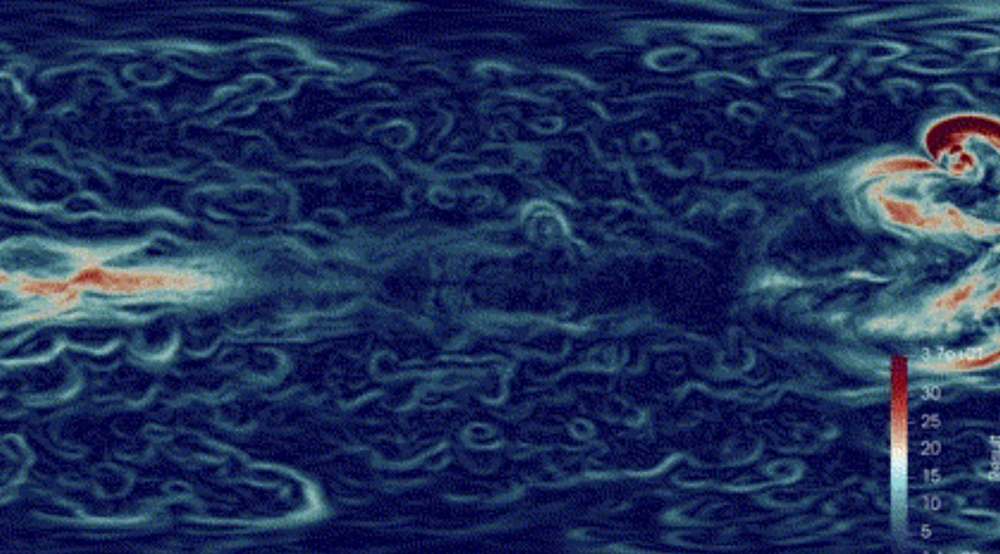

# 👋, I'm Woon Yee
          
📚 My Interest: Artificial Intelligence, High Performance Computing

☕ My Brewing Styles: Mokka Pot and Aeropress

📝 I <del>regulary</del> write articles on <a href="https://woonyee28.github.io/">my blog

## 🤖 My Experience in AI:
| APAC HPC-AI 2024 (SG ⋈ AUS) - Full Training on Llama2 7B   Achieved x6 Speed Up on Gadi Supercomputer | 
| :--: |
|  |

## ⛅ My Experience in HPC:
| ISC High Performance 2024 (Hamburg, Germany) - RegCM | Supercomputing Conference 2024 (Georgia, USA) - ICON |
| :--: | :--: |
|  |  |

